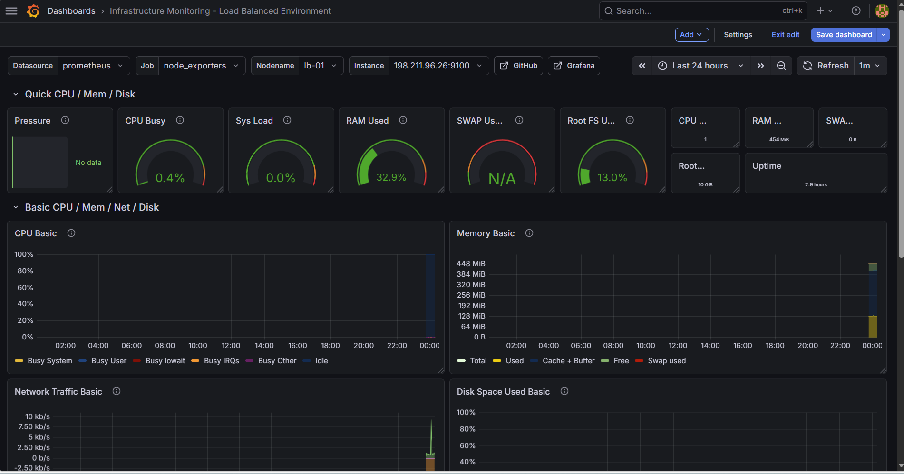

# NetBox + Ansible Automation Lab

This project demonstrates how to use NetBox as a source of truth and Ansible as the automation engine, extended with an NGINX load balancer and real failover testing.

---

## 🚀 Project Overview

In this lab:

- NetBox is used as the source of truth for infrastructure
- Ansible uses NetBox dynamic inventory
- Multiple Linux VMs are managed over SSH
- NGINX is deployed and configured automatically
- A load balancer distributes traffic across backend servers
- Failover behavior is tested and verified

---

## 🏗️ Architecture

NetBox → Ansible Dynamic Inventory → SSH → Managed Hosts → NGINX Load Balancer → Web Servers

---

## ⚙️ Components

- NetBox (Docker-based deployment)
- Ansible
- Dynamic inventory plugin: `netbox.netbox.nb_inventory`
- Load Balancer: `lb-01` (NGINX)
- Backend Servers: `web-01`, `web-02`
- Web Server: nginx

---

## ✅ Achievements

### NetBox + Ansible
- Installed and ran NetBox in Docker
- Created device records in NetBox
- Added interface and primary IP for `web-01`
- Configured SSH key-based access from Master
- Verified dynamic inventory from NetBox
- Ran Ansible ad-hoc ping successfully
- Deployed nginx using Ansible playbook

### Load Balancer (NGINX + Ansible)
- Built NGINX load balancer on a separate VM (`lb-01`)
- Configured round-robin load balancing across backend servers
- Automated load balancer deployment using Ansible
- Implemented Jinja2 template for dynamic configuration
- Converted backend configuration to inventory-driven (no hardcoded IPs)
- Resolved SELinux restriction (`httpd_can_network_connect`)
- Added upstream fail handling (`max_fails`, `fail_timeout`)

---

## 🔄 Failover Test (Real Validation)

- Stopped nginx on `web-01`
- Verified all traffic routed to `web-02`
- Restarted `web-01`
- Confirmed traffic resumed load balancing across both servers

---

## 📂 Repository Structure

---

## 📊 Monitoring & Observability

This project includes a full monitoring stack built using Prometheus and Grafana to observe infrastructure in real time.

### 🔧 Components

- **Node Exporter** installed on:
  - Load balancer (`lb-01`)
  - Backend servers (`web-01`, `web-02`)
- **Prometheus** deployed on `monitor-01`
- **Grafana** deployed on `monitor-01`

### ⚙️ Features

- Real-time monitoring of:
  - CPU usage
  - Memory usage
  - Disk utilization
  - Network traffic
  - System load and uptime
- Centralized metrics collection using Prometheus
- Visualization through Grafana dashboards
- Per-node filtering (load balancer vs backend servers)

### 🔄 Validation

- Verified all Prometheus targets are **UP**
- Confirmed Node Exporter metrics on port `9100`
- Successfully visualized data in Grafana
- Observed metrics across multiple nodes in real time

### 🖥️ Dashboard Example

---

## 🧠 Key DevOps Concepts Demonstrated

- Infrastructure as Code (Ansible)
- Configuration Management
- Load Balancing (NGINX)
- High Availability & Failover
- Monitoring & Observability
- Metrics Collection (Prometheus)
- Visualization (Grafana)
- SSH Automation & Security
- Troubleshooting (SELinux, networking)

---
